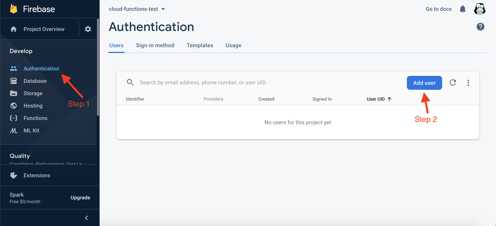
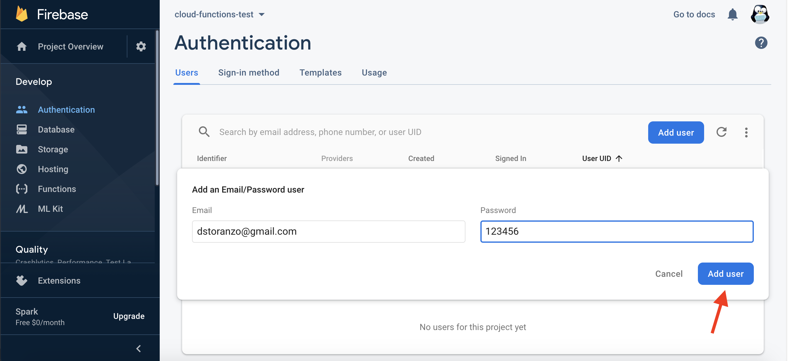
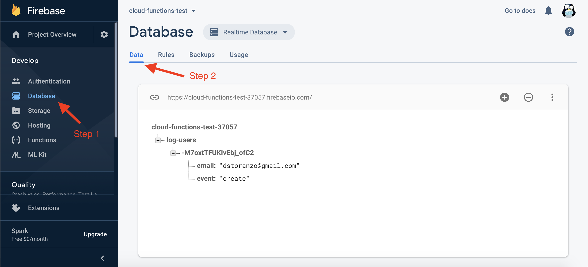

## Description

It setups two cloud functions in cloud-functions-test firebase project.

The first function is executed when we register a user in the project, the second one when we delete a user.

Both functions add an entry to the database in the log-users collection.

## How to test the functions

1. Go to Authentication and click on Add user

2. Complete email and password and click on Add user

3. Go to Database, Data tab and expand the log-users collection

